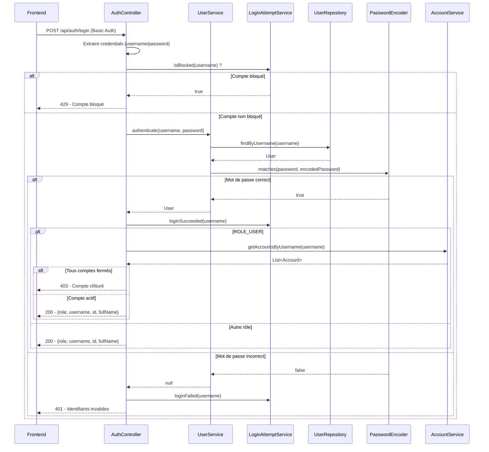
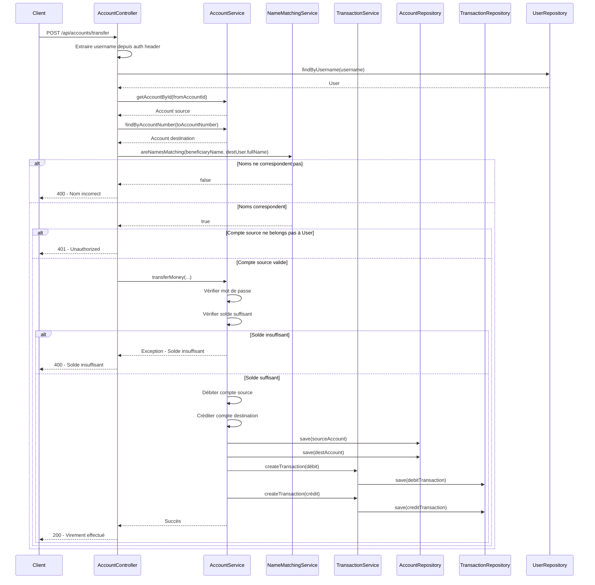

# Documentation Technique - Système de Gestion Bancaire

## 1. Informations de Connexion

### 1.1 Base de Données (MySQL)
```
URL: jdbc:mysql://localhost:3306/banque
Utilisateur: root
Mot de passe: (vide)
Port: 3306
```

### 1.2 Backend (Spring Boot)
```
URL: http://localhost:8082
Port: 8082
```

### 1.3 Frontend (React/Vite)
```
URL: http://localhost:3001
Port: 3001
```

### 1.4 Comptes Utilisateurs Par Défaut

| Rôle | Username | Mot de passe | Email | Nom Complet |
|------|----------|--------------|-------|-------------|
| Administrateur | admin | admin | admin@bank.com | Administrateur Système |
| Directeur | director | director | director@bank.com | Directeur Agence |
| Caissier | cashier | cashier | cashier@bank.com | Caissier Principal |
| Client | client | client | client@bank.com | Client Test |

---

## 2. Architecture Générale

### 2.1 Stack Technologique

**Backend:**
- Java 17
- Spring Boot 3.1.5
- Spring Security
- Spring Data JPA
- MySQL
- Quartz Scheduler (pour virements programmés)

**Frontend:**
- React 18
- TypeScript
- Vite
- Tailwind CSS
- Axios (pour appels API)

---

## 3. Logique Métier

### 3.1 Gestion des Rôles

Le système définit 4 rôles utilisateurs avec des permissions distinctes :

| Rôle | Permissions |
|------|-------------|
| **ROLE_ADMIN** | Gestion complète du système : création/modification/suppression d'utilisateurs, gestion des agences |
| **ROLE_DIRECTOR** | Supervision d'une agence : gestion des caissiers et des clients de son agence, consultation des statistiques |
| **ROLE_CASHIER** | Gestion quotidienne des transactions : dépôts, retraits, création de comptes, consultation des transactions |
| **ROLE_USER** | Gestion personnelle : consultation des comptes, effectuer des virements, programmer des virements, gestion des cartes bancaires, paiement de factures |

### 3.2 Flux Authentification

L'authentification utilise Basic Auth avec les étapes suivantes :
1. L'utilisateur saisit son nom d'utilisateur et son mot de passe
2. Le frontend encode les credentials en Base64 et les envoie via le header `Authorization`
3. Le backend vérifie si le compte est bloqué (3 tentatives échouées → 15min de blocage, récidive → 24h)
4. Si le compte n'est pas bloqué, vérification du mot de passe via BCrypt
5. Pour les clients (ROLE_USER), vérification qu'au moins un compte est actif
6. Stockage des credentials dans le localStorage pour les requêtes suivantes

### 3.3 Flux Virement

Pour effectuer un virement, les étapes de sécurité sont strictes :
1. Vérification que le compte source appartient bien à l'utilisateur connecté
2. Vérification du nom du bénéficiaire (doit correspondre exactement au nom du titulaire du compte destination)
3. Vérification du mot de passe utilisateur pour confirmer l'opération
4. Vérification du solde suffisant sur le compte source
5. Débit du compte source et crédit du compte destination
6. Création de deux transactions (une pour chaque compte)
7. Utilisation de `BigDecimal` pour les montants pour éviter les erreurs d'arrondi

### 3.4 Gestion des Devises

Chaque compte bancaire a une devise associée. Les devises prises en charge sont :
- TND (Dinar Tunisien, défaut)
- EUR (Euro)
- USD (Dollar Américain)
- GBP (Livre Sterling)

---

## 4. Diagramme de Classe

```mermaid
classDiagram
    class User {
        +Long id
        +String username
        +String password
        +String role
        +String email
        +String fullName
        +String address
        +String phone
        +Set~Account~ accounts
        +Agency agency
    }

    class Agency {
        +Long id
        +String code
        +String name
        +String address
        +String phone
        +String email
        +LocalDateTime createdAt
        +User director
        +Boolean isActive
    }

    class Account {
        +Long id
        +String accountNumber
        +BigDecimal balance
        +User user
        +String status
        +Currency currency
    }

    class BankCard {
        +Long id
        +String cardNumber
        +CardType cardType
        +Account account
        +LocalDate expirationDate
        +String cvv
    }

    enum CardType {
        VISA
        MASTERCARD
    }

    enum Currency {
        TND
        EUR
        USD
        GBP
    }

    class Transaction {
        +Long id
        +BigDecimal amount
        +String type
        +String description
        +Date date
        +String status
        +Account account
        +String fromAccount
        +String toAccount
        +ExpenseCategory category
    }

    class ExpenseCategory {
        +Long id
        +String name
        +String color
    }

    class VirementProgramme {
        +Long id
        +Account compteSource
        +String numeroCompteDestination
        +String beneficiaireName
        +BigDecimal montant
        +LocalDateTime dateExecution
        +boolean executed
        +VirementStatus status
        +String refusReason
    }

    enum VirementStatus {
        EN_ATTENTE
        EXECUTE
        REFUSE
        ANNULE
    }

    class CashierLog {
        +Long id
        +String type
        +String description
        +LocalDateTime date
        +BigDecimal amount
        +String accountNumber
        +String userName
        +String status
        +String details
        +User cashier
    }

    class AuditLog {
        +Long id
        +String eventType
        +String entityType
        +Long entityId
        +String oldValue
        +String newValue
        +String performedBy
        +LocalDateTime performedAt
        +String ipAddress
    }

    User "1" --* "*" Account : possède
    User "*" -- "1" Agency : appartient à
    Agency "1" -- "1" User : a pour directeur
    Account "1" --* "*" Transaction : a
    Account "1" --* "*" BankCard : a
    Account "1" --* "*" VirementProgramme : source de
    Transaction "*" -- "1" ExpenseCategory : catégorie
    CashierLog "*" -- "1" User : effectué par
```

---

## 5. Diagramme de Séquence - Authentification



---

## 6. Diagramme de Séquence - Virement



---

## 7. Diagramme de Use Case

```mermaid
useCaseDiagram
    actor Admin
    actor Director
    actor Cashier
    actor Client
    
    package Système Bancaire {
        usecase "Se connecter" as UC1
        usecase "S'inscrire" as UC14
        usecase "Gérer utilisateurs" as UC2
        usecase "Gérer agences" as UC3
        usecase "Gérer comptes" as UC4
        usecase "Effectuer virement" as UC5
        usecase "Virement programmé" as UC6
        usecase "Voir transactions" as UC7
        usecase "Voir statistiques" as UC8
        usecase "Gérer cartes bancaires" as UC9
        usecase "Payer factures" as UC10
        usecase "Gérer caissier logs" as UC11
        usecase "Voir statistiques agence" as UC12
        usecase "Gérer clients" as UC13
    }
    
    Admin --> UC1
    Admin --> UC2
    Admin --> UC3
    Admin --> UC7
    
    Director --> UC1
    Director --> UC12
    Director --> UC13
    Director --> UC7
    
    Cashier --> UC1
    Cashier --> UC4
    Cashier --> UC11
    Cashier --> UC7
    
    Client --> UC1
    Client --> UC14
    Client --> UC4
    Client --> UC5
    Client --> UC6
    Client --> UC7
    Client --> UC8
    Client --> UC9
    Client --> UC10
```

---

## 8. Modules du Projet

### 8.1 Backend - Structure

```
Backend/
├── src/main/java/com/example/bank/demo/
│   ├── config/
│   │   ├── AsyncConfig.java          # Configuration asynchrone
│   │   └── SecurityConfig.java       # Configuration Spring Security
│   ├── controller/
│   │   ├── AccountController.java    # API comptes, virements, transactions
│   │   ├── AdminController.java      # API administration
│   │   ├── AuthController.java       # API authentification et inscription
│   │   ├── CashierController.java    # API caissier
│   │   ├── DirectorController.java   # API directeur
│   │   └── HomeController.java       # API accueil
│   ├── exception/
│   │   ├── GlobalExceptionHandler.java
│   │   └── ValidationException.java
│   ├── model/
│   │   ├── Account.java
│   │   ├── AccountCreationRequest.java
│   │   ├── Agency.java
│   │   ├── AuditLog.java
│   │   ├── BankCard.java
│   │   ├── CashierLog.java
│   │   ├── Currency.java
│   │   ├── ExpenseCategory.java
│   │   ├── Transaction.java
│   │   ├── TransferRequest.java
│   │   ├── User.java
│   │   ├── VirementProgramme.java
│   │   └── VirementStatus.java
│   ├── repository/
│   │   ├── AccountRepository.java
│   │   ├── AgencyRepository.java
│   │   ├── AuditLogRepository.java
│   │   ├── BankCardRepository.java
│   │   ├── CashierLogRepository.java
│   │   ├── TransactionRepository.java
│   │   ├── UserRepository.java
│   │   └── VirementProgrammeRepository.java
│   ├── security/
│   │   └── LoginAttemptService.java  # Protection contre brute force
│   ├── service/
│   │   ├── AccountService.java
│   │   ├── AgencyService.java
│   │   ├── AgencyStatsService.java
│   │   ├── AuditLogService.java
│   │   ├── CashierLogService.java
│   │   ├── NameMatchingService.java  # Vérification nom bénéficiaire
│   │   ├── TransactionService.java
│   │   ├── UserService.java
│   │   └── VirementProgrammeService.java
│   ├── util/
│   │   └── CryptoConverter.java      # Chiffrement AES des données de carte
│   └── DemoApplication.java          # Point d'entrée
└── src/main/resources/
    ├── application.properties        # Configuration
    ├── schema.sql                    # Schéma DB
    └── data.sql                      # Données initiales
```

### 8.2 Frontend - Structure

```
Frontend/
├── src/
│   ├── components/
│   │   ├── AccountComponent.tsx          # Gestion comptes client
│   │   ├── AdminDashboard.tsx            # Dashboard admin
│   │   ├── CashierDashboard.tsx          # Dashboard caissier
│   │   ├── DirectorAgencyStats.tsx       # Stats agence
│   │   ├── DirectorClientManagement.tsx  # Gestion clients
│   │   ├── DirectorDashboard.tsx         # Dashboard directeur
│   │   ├── FediComponent.tsx
│   │   ├── LoginComponent.tsx            # Page connexion
│   │   ├── LogoutButton.tsx
│   │   ├── Navbar.tsx
│   │   ├── ProfileComponent.tsx
│   │   └── RegisterComponent.tsx         # Page inscription
│   ├── pages/
│   │   └── DirectorFedi.tsx
│   ├── types/
│   │   └── statistics.ts
│   ├── App.tsx
│   ├── api.ts                            # Configuration API
│   ├── counter.ts
│   ├── main.tsx
│   ├── style.css
│   └── vite-env.d.ts
├── index.html
├── package.json
├── tailwind.config.js
├── tsconfig.json
└── vite.config.ts
```

---

## 9. Points Clés de la Sécurité

1. **Authentification Basic Auth** avec Base64
2. **BCrypt Password Encoding** pour stocker les mots de passe
3. **Protection contre brute force** via LoginAttemptService:
   - 3 tentatives échouées → blocage 15 minutes
   - Nouveau blocage → 24 heures
4. **CORS Configuré** pour localhost:3000, :3001, :5173
5. **Vérification du nom du bénéficiaire** avant virement
6. **Validation de l'appartenance du compte** à l'utilisateur
7. **Utilisation de BigDecimal** pour tous les montants pour éviter les erreurs d'arrondi catastrophiques
8. **Chiffrement AES** des numéros de carte bancaire et CVV avant stockage dans la base de données
9. **Audit Log** complet de toutes les actions importantes du système

---

## 10. Initialisation des Données

Au démarrage, le système crée automatiquement:
1. Une agence par défaut (AGN001 - Agence Principale)
2. Un administrateur (admin/admin)
3. Un directeur (director/director)
4. Un caissier (cashier/cashier)
5. 6 catégories de dépenses (Alimentation, Transport, Logement, Loisirs, Santé, Autres)

---

## 11. API Principales

### Authentification & Inscription
- `POST /api/auth/login` - Connexion utilisateur
- `POST /api/auth/register` - Inscription d'un nouveau client

### Comptes
- `GET /api/accounts` - Récupérer les comptes de l'utilisateur connecté
- `POST /api/accounts` - Créer un nouveau compte
- `POST /api/accounts/transfer` - Effectuer un virement
- `GET /api/accounts/{accountId}/transactions` - Consulter les transactions d'un compte
- `GET /api/accounts/statistics` - Obtenir les statistiques générales
- `POST /api/accounts/transfer/programme` - Programmer un virement futur
- `GET /api/accounts/transfers/programmes` - Voir les virements programmés
- `POST /api/accounts/pay-bill` - Payer une facture
- `DELETE /api/accounts/transfers/programmes/{virementId}` - Annuler un virement programmé

### Admin
- Gestion utilisateurs, agences, etc.
